### Hi there, I'm Trent. Welcome to my repositories.

I build Arduino libraries, embedded tools, chess engines, robotics projects, developer utilities, and the occasional game. My interests include language design, FPGAs, compiler design, kernel development, high-speed networking, embedded systems, industrial automation, paleontology, drumming, math, and skydiving.

## Current Notes

- I write a lot of small libraries and experiments around Arduino, C++, Python, and game/search algorithms.
- The nickname Ripred came from *The Underland Chronicles*.
- I am looking for sponsors for Buffy the Pack Mule, my digital fossil-hunting robot and equipment carrier.
- GitHub-only contact: open an issue in [ripred/ripred](https://github.com/ripred/ripred/issues/new).

## Recent Public Work

<!-- RECENT-PUBLIC-WORK:START -->
- [automod](https://github.com/ripred/automod) - This is a template repo for syncing Reddit AutoMod settings with GitHub. It automatically updates and fetches the configuration using Pytho...
- [Wheeluino](https://github.com/ripred/Wheeluino) - A microcontroller operated Wheel-O! A simple desktop toy that makes an Arduino control a Wheel-O toy. 😎.
- [viber](https://github.com/ripred/viber) - AI Coding Assistant.
- [unoq-balancer-brick-bot](https://github.com/ripred/unoq-balancer-brick-bot) - Custom Uno-Q Balancing Robot Brick and Custom Application!
- [Uno_R4_Space_Invaders](https://github.com/ripred/Uno_R4_Space_Invaders) - Quick and Dirty Space Invaders on the Uno R4 Wifi LED Matrix!
- [Uno-Q-Defender](https://github.com/ripred/Uno-Q-Defender) - Defender-style game for Arduino UNO Q 13x8 LED matrix with grayscale shading, demo self-play, and parallax.
<!-- RECENT-PUBLIC-WORK:END -->

<!-- PROFILE-SHOWCASE:START -->
## Custom User Pinned Repositories

My bespoke repository showcase.

<table>
<tbody>
<tr>
<td width="33.3333%" valign="top">

<picture></picture>
<strong>JavaChess</strong> 
Java | Public | Stars: 16 | Forks: 3 | Updated: 2026-06-17 | Expand / collapse

<a href="https://github.com/ripred/JavaChess">Repository</a> | <a href="https://github.com/ripred/JavaChess/issues">Issues</a> | <a href="https://github.com/ripred/JavaChess/actions">Actions</a> | <a href="https://github.com/ripred/JavaChess/releases">Releases</a> | <a href="https://github.com/ripred/JavaChess/blob/master/README.md">README</a>

</td>
<td width="33.3333%" valign="top">

<picture></picture>
<strong>MicroChess</strong> 
C++ | Public | Stars: 31 | Forks: 4 | Updated: 2026-06-17 | Expand / collapse

<a href="https://github.com/ripred/MicroChess">Repository</a> | <a href="https://github.com/ripred/MicroChess/issues">Issues</a> | <a href="https://github.com/ripred/MicroChess/actions">Actions</a> | <a href="https://github.com/ripred/MicroChess/releases">Releases</a> | <a href="https://github.com/ripred/MicroChess/blob/main/README.md">README</a> | <a href="https://github.com/ripred/microchess">Homepage</a>

</td>
<td width="33.3333%" valign="top">

<picture></picture>
<strong>CPUVolt</strong> 
C++ | Public | Stars: 81 | Forks: 3 | Updated: 2026-06-17 | Expand / collapse

<a href="https://github.com/ripred/CPUVolt">Repository</a> | <a href="https://github.com/ripred/CPUVolt/issues">Issues</a> | <a href="https://github.com/ripred/CPUVolt/actions">Actions</a> | <a href="https://github.com/ripred/CPUVolt/releases">Releases</a> | <a href="https://github.com/ripred/CPUVolt/blob/main/README.md">README</a> | <a href="https://github.com/ripred/CPUVolt">Homepage</a>

</td>
</tr>
<tr>
<td width="33.3333%" valign="top">

<picture></picture>
<strong>Smooth</strong> 
C++ | Public | Stars: 63 | Forks: 3 | Updated: 2026-06-17 | Expand / collapse

<a href="https://github.com/ripred/Smooth">Repository</a> | <a href="https://github.com/ripred/Smooth/issues">Issues</a> | <a href="https://github.com/ripred/Smooth/actions">Actions</a> | <a href="https://github.com/ripred/Smooth/releases">Releases</a> | <a href="https://github.com/ripred/Smooth/blob/main/README.md">README</a> | <a href="https://github.com/ripred/Smooth">Homepage</a>

</td>
<td width="33.3333%" valign="top">

<picture></picture>
<strong>Bang</strong> 
Python | Public | Stars: 22 | Forks: 0 | Updated: 2026-06-17 | Expand / collapse

<a href="https://github.com/ripred/Bang">Repository</a> | <a href="https://github.com/ripred/Bang/issues">Issues</a> | <a href="https://github.com/ripred/Bang/actions">Actions</a> | <a href="https://github.com/ripred/Bang/releases">Releases</a> | <a href="https://github.com/ripred/Bang/blob/main/README.md">README</a> | <a href="https://github.com/ripred/Bang">Homepage</a>

</td>
<td width="33.3333%" valign="top">

<picture></picture>
<strong>Arduino-Stuff</strong> 
Mixed | Public | Stars: 3 | Forks: 1 | Updated: 2026-06-17 | Expand / collapse

<a href="https://github.com/ripred/Arduino-Stuff">Repository</a> | <a href="https://github.com/ripred/Arduino-Stuff/issues">Issues</a> | <a href="https://github.com/ripred/Arduino-Stuff/actions">Actions</a> | <a href="https://github.com/ripred/Arduino-Stuff/releases">Releases</a> | <a href="https://github.com/ripred/Arduino-Stuff/blob/main/README.md">README</a> | <a href="https://github.com/ripred/Arduino-Stuff">Homepage</a>

</td>
</tr>
<tr>
<td width="33.3333%" valign="top">

<picture></picture>
<strong>BetterMenu</strong> 
C++ | Public | Stars: 8 | Forks: 0 | Updated: 2026-06-17 | Expand / collapse

<a href="https://github.com/ripred/BetterMenu">Repository</a> | <a href="https://github.com/ripred/BetterMenu/issues">Issues</a> | <a href="https://github.com/ripred/BetterMenu/actions">Actions</a> | <a href="https://github.com/ripred/BetterMenu/releases">Releases</a> | <a href="https://github.com/ripred/BetterMenu/blob/main/README.md">README</a>

</td>
<td width="33.3333%" valign="top">

<picture></picture>
<strong>github-traffic</strong> 
Python | Public | Stars: 1 | Forks: 0 | Updated: 2026-06-17 | Expand / collapse

<a href="https://github.com/ripred/github-traffic">Repository</a> | <a href="https://github.com/ripred/github-traffic/issues">Issues</a> | <a href="https://github.com/ripred/github-traffic/actions">Actions</a> | <a href="https://github.com/ripred/github-traffic/releases">Releases</a> | <a href="https://github.com/ripred/github-traffic/blob/main/README.md">README</a>

</td>
<td width="33.3333%" valign="top">

</td>
</tr>
</tbody>
</table>
<!-- PROFILE-SHOWCASE:END -->
