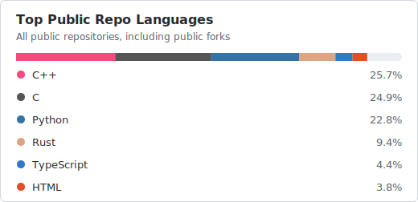

### Hi there, I'm Trent. Welcome to my repositories.

I build Arduino libraries, embedded tools, chess engines, robotics projects, developer utilities, and the occasional game. My interests include language design, FPGAs, compiler design, kernel development, high-speed networking, embedded systems, industrial automation, paleontology, drumming, math, and skydiving.

## Pinned Repositories

<!-- PROFILE-SHOWCASE:START -->
A generated repository showcase maintained from the private profile automation backend.

<table>
<tbody>
<tr>
<td width="72%" valign="top">
<a href="https://github.com/ripred/JavaChess"><strong>JavaChess</strong></a> 
Java | Public | Stars: 16 | Forks: 3 | Updated: 2026-06-17
</td>
<td width="28%" align="right" valign="top">
Expand / collapse
</td>
</tr>
</tbody>
</table>

<table>
<tbody>
<tr>
<td width="100%" valign="top">
24-bit ANSI colored console chess engine with configurable Minimax AI.
  
<strong>Repository details</strong>
<ul>
<li><strong>Language:</strong> Java</li>
<li><strong>Visibility:</strong> Public</li>
<li><strong>Default branch:</strong> master</li>
<li><strong>License:</strong> MIT</li>
<li><strong>Created:</strong> 2019-07-02</li>
<li><strong>Last pushed:</strong> 2026-06-17</li>
<li><strong>Stars:</strong> 16</li>
<li><strong>Forks:</strong> 3</li>
<li><strong>Open issues:</strong> 1</li>
<li><strong>Repository size:</strong> 1,056 KB</li>
<li><strong>Topics:</strong> alpha-beta-pruning, chess, chess-ai, chess-engine, configurable, console-color, console-game, java</li>
</ul>
<strong>Links:</strong> <a href="https://github.com/ripred/JavaChess">Repository</a> | <a href="https://github.com/ripred/JavaChess/issues">Issues</a> | <a href="https://github.com/ripred/JavaChess/actions">Actions</a> | <a href="https://github.com/ripred/JavaChess/releases">Releases</a> | <a href="https://github.com/ripred/JavaChess/blob/master/README.md">README</a>
</td>
</tr>
</tbody>
</table>

<table>
<tbody>
<tr>
<td width="72%" valign="top">
<a href="https://github.com/ripred/MicroChess"><strong>MicroChess</strong></a> 
C++ | Public | Stars: 31 | Forks: 4 | Updated: 2026-06-17
</td>
<td width="28%" align="right" valign="top">
Expand / collapse
</td>
</tr>
</tbody>
</table>

<table>
<tbody>
<tr>
<td width="100%" valign="top">
Embedded chess engine designed to use less than 2K of RAM.
  
<strong>Repository details</strong>
<ul>
<li><strong>Language:</strong> C++</li>
<li><strong>Visibility:</strong> Public</li>
<li><strong>Default branch:</strong> main</li>
<li><strong>License:</strong> MIT</li>
<li><strong>Created:</strong> 2023-03-12</li>
<li><strong>Last pushed:</strong> 2026-06-17</li>
<li><strong>Stars:</strong> 31</li>
<li><strong>Forks:</strong> 4</li>
<li><strong>Open issues:</strong> 2</li>
<li><strong>Repository size:</strong> 26,380 KB</li>
<li><strong>Topics:</strong> algorithms-and-data-structures, alpha-beta-pruning, arduino, arduino-nano, arduino-platform, arduino-uno, bitfields, chess</li>
</ul>
<strong>Links:</strong> <a href="https://github.com/ripred/MicroChess">Repository</a> | <a href="https://github.com/ripred/MicroChess/issues">Issues</a> | <a href="https://github.com/ripred/MicroChess/actions">Actions</a> | <a href="https://github.com/ripred/MicroChess/releases">Releases</a> | <a href="https://github.com/ripred/MicroChess/blob/main/README.md">README</a> | <a href="https://github.com/ripred/microchess">Homepage</a>
</td>
</tr>
</tbody>
</table>

<table>
<tbody>
<tr>
<td width="72%" valign="top">
<a href="https://github.com/ripred/CPUVolt"><strong>CPUVolt</strong></a> 
C++ | Public | Stars: 81 | Forks: 3 | Updated: 2026-06-17
</td>
<td width="28%" align="right" valign="top">
Expand / collapse
</td>
</tr>
</tbody>
</table>

<table>
<tbody>
<tr>
<td width="100%" valign="top">
Read processor Vcc and estimate battery capacity on ATmega-based Arduino projects without external components.
  
<strong>Repository details</strong>
<ul>
<li><strong>Language:</strong> C++</li>
<li><strong>Visibility:</strong> Public</li>
<li><strong>Default branch:</strong> main</li>
<li><strong>License:</strong> MIT</li>
<li><strong>Created:</strong> 2022-05-14</li>
<li><strong>Last pushed:</strong> 2026-06-17</li>
<li><strong>Stars:</strong> 81</li>
<li><strong>Forks:</strong> 3</li>
<li><strong>Open issues:</strong> 0</li>
<li><strong>Repository size:</strong> 82 KB</li>
<li><strong>Topics:</strong> arduino, arduino-library, arduino-library-manager, atmega, avr, battery-monitor, battery-powered, cpp</li>
</ul>
<strong>Links:</strong> <a href="https://github.com/ripred/CPUVolt">Repository</a> | <a href="https://github.com/ripred/CPUVolt/issues">Issues</a> | <a href="https://github.com/ripred/CPUVolt/actions">Actions</a> | <a href="https://github.com/ripred/CPUVolt/releases">Releases</a> | <a href="https://github.com/ripred/CPUVolt/blob/main/README.md">README</a> | <a href="https://github.com/ripred/CPUVolt">Homepage</a>
</td>
</tr>
</tbody>
</table>

<table>
<tbody>
<tr>
<td width="72%" valign="top">
<a href="https://github.com/ripred/Smooth"><strong>Smooth</strong></a> 
C++ | Public | Stars: 63 | Forks: 3 | Updated: 2026-06-17
</td>
<td width="28%" align="right" valign="top">
Expand / collapse
</td>
</tr>
</tbody>
</table>

<table>
<tbody>
<tr>
<td width="100%" valign="top">
Compact exponential moving averages with constant memory and runtime.
  
<strong>Repository details</strong>
<ul>
<li><strong>Language:</strong> C++</li>
<li><strong>Visibility:</strong> Public</li>
<li><strong>Default branch:</strong> main</li>
<li><strong>License:</strong> MIT</li>
<li><strong>Created:</strong> 2023-06-18</li>
<li><strong>Last pushed:</strong> 2026-06-17</li>
<li><strong>Stars:</strong> 63</li>
<li><strong>Forks:</strong> 3</li>
<li><strong>Open issues:</strong> 0</li>
<li><strong>Repository size:</strong> 54 KB</li>
<li><strong>Topics:</strong> arduino, arduino-library, arduino-library-manager, callbacks, constant-memory, constant-time, cpp, cpp-library</li>
</ul>
<strong>Links:</strong> <a href="https://github.com/ripred/Smooth">Repository</a> | <a href="https://github.com/ripred/Smooth/issues">Issues</a> | <a href="https://github.com/ripred/Smooth/actions">Actions</a> | <a href="https://github.com/ripred/Smooth/releases">Releases</a> | <a href="https://github.com/ripred/Smooth/blob/main/README.md">README</a> | <a href="https://github.com/ripred/Smooth">Homepage</a>
</td>
</tr>
</tbody>
</table>

<table>
<tbody>
<tr>
<td width="72%" valign="top">
<a href="https://github.com/ripred/Bang"><strong>Bang</strong></a> 
Python | Public | Stars: 22 | Forks: 0 | Updated: 2026-06-17
</td>
<td width="28%" align="right" valign="top">
Expand / collapse
</td>
</tr>
</tbody>
</table>

<table>
<tbody>
<tr>
<td width="100%" valign="top">
Host-command bridge for microcontrollers that need a PC, Mac, or Linux machine to act as a service.
  
<strong>Repository details</strong>
<ul>
<li><strong>Language:</strong> Python</li>
<li><strong>Visibility:</strong> Public</li>
<li><strong>Default branch:</strong> main</li>
<li><strong>License:</strong> MIT</li>
<li><strong>Created:</strong> 2023-12-08</li>
<li><strong>Last pushed:</strong> 2026-06-17</li>
<li><strong>Stars:</strong> 22</li>
<li><strong>Forks:</strong> 0</li>
<li><strong>Open issues:</strong> 0</li>
<li><strong>Repository size:</strong> 306 KB</li>
<li><strong>Topics:</strong> arduino, arduino-curl, arduino-file-io, arduino-library, command-line-tool, cplusplus, cpp, embedded</li>
</ul>
<strong>Links:</strong> <a href="https://github.com/ripred/Bang">Repository</a> | <a href="https://github.com/ripred/Bang/issues">Issues</a> | <a href="https://github.com/ripred/Bang/actions">Actions</a> | <a href="https://github.com/ripred/Bang/releases">Releases</a> | <a href="https://github.com/ripred/Bang/blob/main/README.md">README</a> | <a href="https://github.com/ripred/Bang">Homepage</a>
</td>
</tr>
</tbody>
</table>

<table>
<tbody>
<tr>
<td width="72%" valign="top">
<a href="https://github.com/ripred/Arduino-Stuff"><strong>Arduino-Stuff</strong></a> 
Mixed | Public | Stars: 3 | Forks: 1 | Updated: 2026-06-17
</td>
<td width="28%" align="right" valign="top">
Expand / collapse
</td>
</tr>
</tbody>
</table>

<table>
<tbody>
<tr>
<td width="100%" valign="top">
Official Arduino libraries and personal embedded projects.
  
<strong>Repository details</strong>
<ul>
<li><strong>Language:</strong> Mixed</li>
<li><strong>Visibility:</strong> Public</li>
<li><strong>Default branch:</strong> main</li>
<li><strong>License:</strong> MIT</li>
<li><strong>Created:</strong> 2021-12-21</li>
<li><strong>Last pushed:</strong> 2026-06-17</li>
<li><strong>Stars:</strong> 3</li>
<li><strong>Forks:</strong> 1</li>
<li><strong>Open issues:</strong> 0</li>
<li><strong>Repository size:</strong> 44 KB</li>
<li><strong>Topics:</strong> arduino, arduino-library, arduino-programming, arduino-projects</li>
</ul>
<strong>Links:</strong> <a href="https://github.com/ripred/Arduino-Stuff">Repository</a> | <a href="https://github.com/ripred/Arduino-Stuff/issues">Issues</a> | <a href="https://github.com/ripred/Arduino-Stuff/actions">Actions</a> | <a href="https://github.com/ripred/Arduino-Stuff/releases">Releases</a> | <a href="https://github.com/ripred/Arduino-Stuff/blob/main/README.md">README</a> | <a href="https://github.com/ripred/Arduino-Stuff">Homepage</a>
</td>
</tr>
</tbody>
</table>

<table>
<tbody>
<tr>
<td width="72%" valign="top">
<a href="https://github.com/ripred/BetterMenu"><strong>BetterMenu</strong></a> 
C++ | Public | Stars: 8 | Forks: 0 | Updated: 2026-06-17
</td>
<td width="28%" align="right" valign="top">
Expand / collapse
</td>
</tr>
</tbody>
</table>

<table>
<tbody>
<tr>
<td width="100%" valign="top">
Declarative, adapter-friendly menu infrastructure for embedded projects.
  
<strong>Repository details</strong>
<ul>
<li><strong>Language:</strong> C++</li>
<li><strong>Visibility:</strong> Public</li>
<li><strong>Default branch:</strong> main</li>
<li><strong>License:</strong> MIT</li>
<li><strong>Created:</strong> 2025-09-14</li>
<li><strong>Last pushed:</strong> 2026-06-17</li>
<li><strong>Stars:</strong> 8</li>
<li><strong>Forks:</strong> 0</li>
<li><strong>Open issues:</strong> 0</li>
<li><strong>Repository size:</strong> 954 KB</li>
<li><strong>Topics:</strong> arduino, arduino-library, cpp, embedded, esp32-arduino, menu, rp2040-arduino</li>
</ul>
<strong>Links:</strong> <a href="https://github.com/ripred/BetterMenu">Repository</a> | <a href="https://github.com/ripred/BetterMenu/issues">Issues</a> | <a href="https://github.com/ripred/BetterMenu/actions">Actions</a> | <a href="https://github.com/ripred/BetterMenu/releases">Releases</a> | <a href="https://github.com/ripred/BetterMenu/blob/main/README.md">README</a>
</td>
</tr>
</tbody>
</table>

<table>
<tbody>
<tr>
<td width="72%" valign="top">
<a href="https://github.com/ripred/github-traffic"><strong>github-traffic</strong></a> 
Python | Public | Stars: 1 | Forks: 0 | Updated: 2026-06-17
</td>
<td width="28%" align="right" valign="top">
Expand / collapse
</td>
</tr>
</tbody>
</table>

<table>
<tbody>
<tr>
<td width="100%" valign="top">
Command-line reporting for repository traffic, views, stars, forks, and clones.
  
<strong>Repository details</strong>
<ul>
<li><strong>Language:</strong> Python</li>
<li><strong>Visibility:</strong> Public</li>
<li><strong>Default branch:</strong> main</li>
<li><strong>License:</strong> MIT</li>
<li><strong>Created:</strong> 2025-03-13</li>
<li><strong>Last pushed:</strong> 2026-06-17</li>
<li><strong>Stars:</strong> 1</li>
<li><strong>Forks:</strong> 0</li>
<li><strong>Open issues:</strong> 0</li>
<li><strong>Repository size:</strong> 959 KB</li>
<li><strong>Topics:</strong> analytics, cli, clones, command-line, developer-tools, forks, github, github-api</li>
</ul>
<strong>Links:</strong> <a href="https://github.com/ripred/github-traffic">Repository</a> | <a href="https://github.com/ripred/github-traffic/issues">Issues</a> | <a href="https://github.com/ripred/github-traffic/actions">Actions</a> | <a href="https://github.com/ripred/github-traffic/releases">Releases</a> | <a href="https://github.com/ripred/github-traffic/blob/main/README.md">README</a>
</td>
</tr>
</tbody>
</table>

<!-- PROFILE-SHOWCASE:END -->

## Current Notes

- I write a lot of small libraries and experiments around Arduino, C++, Python, and game/search algorithms.
- The nickname Ripred came from *The Underland Chronicles*.
- I am looking for sponsors for Buffy the Pack Mule, my digital fossil-hunting robot and equipment carrier.
- GitHub-only contact: open an issue in [ripred/ripred](https://github.com/ripred/ripred/issues/new).

## Recent Public Work

<!-- RECENT-PUBLIC-WORK:START -->
- [automod](https://github.com/ripred/automod) - This is a template repo for syncing Reddit AutoMod settings with GitHub. It automatically updates and fetches the configuration using Pytho...
- [Wheeluino](https://github.com/ripred/Wheeluino) - A microcontroller operated Wheel-O! A simple desktop toy that makes an Arduino control a Wheel-O toy. 😎.
- [viber](https://github.com/ripred/viber) - AI Coding Assistant.
- [unoq-balancer-brick-bot](https://github.com/ripred/unoq-balancer-brick-bot) - Custom Uno-Q Balancing Robot Brick and Custom Application!
- [Uno_R4_Space_Invaders](https://github.com/ripred/Uno_R4_Space_Invaders) - Quick and Dirty Space Invaders on the Uno R4 Wifi LED Matrix!
- [Uno-Q-Defender](https://github.com/ripred/Uno-Q-Defender) - Defender-style game for Arduino UNO Q 13x8 LED matrix with grayscale shading, demo self-play, and parallax.
<!-- RECENT-PUBLIC-WORK:END -->

